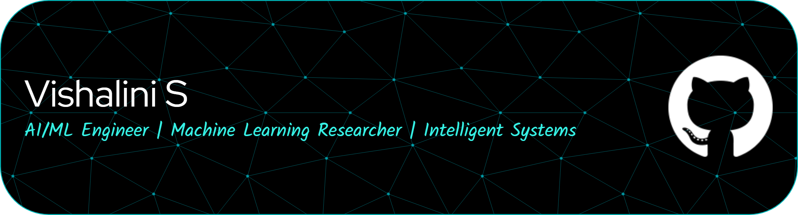

  

  

# 💫 Vishalini S
### AI/ML Engineer | Machine Learning Researcher | Intelligent Systems

> *"Creativity alone builds systems where logic finds its limit."*

I thrive at the intersection of **Artificial Intelligence** and **Intelligent Systems**, building scalable and production-ready pipelines. My work bridges the gap between research-level complexity and real-world software engineering.

---

### 🧠 Research & Focus
● **Large Language Models** & Efficient Inference  
● **Retrieval-Augmented Generation** (RAG)  
● **Computer Vision** & Representation Learning  
● **Space Tech** & Satellite Imagery Analysis

---

### 🌟 Featured Projects

**🛰️ SentinelWatch** Satellite change detection system using a **Siamese Vision Transformer** to identify land-surface changes from multi-temporal Sentinel-2 imagery. Generates spatial confidence maps with a Gradio interface.  
*Tech: PyTorch, Vision Transformers, OpenCV, Gradio*

**🛡️ RateGuard** Redis-backed API rate limiter implementing token bucket algorithms with **ML-based traffic classification**. Features a real-time dashboard for monitoring and adaptive throttling.  
*Tech: Python, Redis, Machine Learning*

**📓 NoteLooms** AI-powered study platform that transforms PDFs and YouTube content into summaries and flashcards using a **Retrieval-Augmented Generation (RAG)** pipeline.  
*Tech: React, Flask, Gemini API, ChromaDB*

---

### 🛠️ Tech Stack

**Languages**    

**AI / Machine Learning**    

**Web & Frameworks**    

**Infrastructure**    

---

### 📊 GitHub Insights

  
  

---

### 🌐 Connect With Me
 

  

