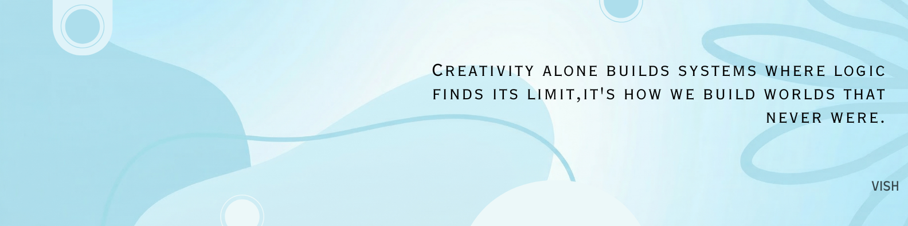

  

  

# ❄️ Vishalini S
### AI/ML Engineer | Machine Learning Researcher | Intelligent Systems

I thrive at the intersection of **Artificial Intelligence** and **Intelligent Systems**, building scalable and production-ready pipelines. My work bridges the gap between research-level complexity and real-world software engineering.

---

### 🧠 Research & Focus
● **Large Language Models** & Efficient Inference  
● **Retrieval-Augmented Generation** (RAG)  
● **Space Tech** & Satellite Imagery Analysis  
● **Industrial Analytics** (Dynamic Time Warping & "Golden Signatures")

---

### 🌟 Featured Projects

| Project | Description | Tech Stack |
| :--- | :--- | :--- |
| **SentinelWatch** | Satellite change detection using a **Siamese Vision Transformer**. | PyTorch, ViT, OpenCV |
| **RateGuard** | Redis-backed API rate limiter with **ML traffic classification**. | Java, Python, Redis |
| **NoteLooms** | AI study platform transforming PDFs/YouTube via a **RAG pipeline**. | React, Flask, Gemini |

---

### 🛠️ Tech Stack

#### **Programming Languages**
    

#### **Database Systems**
  

#### **Machine Learning & Data Science**
   

#### **Web & Frameworks**
   

---

### 📊 GitHub Insights

  
  

---

### 🌐 Connect With Me
 

  

